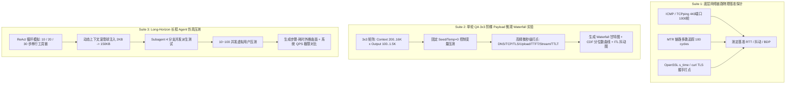

# Gemini 跨云 vs 同构网络性能与 Agent 仿真基准测试实验方案设计

> **方案状态**：正式交付版 (Engineering Benchmark Specification v1.0)  
> **适用范围**：评估客户现有机房（AWS 爱尔兰 `eu-west-1` / 本地 IDC）跨云调用 GCP 欧洲 Gemini 与全栈同构部署在 GCP `europe-west4` 的端到端性能差异  
> **责任机构**：Google Cloud Customer Engineering & Architecture Team

---

## 目录

- [一、 实验目标与核心科学假设](#一-实验目标与核心科学假设)
- [二、 测试拓扑与环境规划](#二-测试拓扑与环境规划)
- [三、 实验设计体系（三大分层测试套件）](#三-实验设计体系三大分层测试套件)
  - [Suite 1: 底层网络链路物理基准探针 (L3/L4/L7 Probing)](#suite-1-底层网络链路物理基准探针-l3l4l7-probing)
  - [Suite 2: 单轮 QA 3×3 阶梯 Payload 微观 Waterfall 实验](#suite-2-单轮-qa-33-阶梯-payload-微观-waterfall-实验)
  - [Suite 3: Long-Horizon 长程 Agent 仿真与并发压测](#suite-3-long-horizon-长程-agent-仿真与并发压测)
- [四、 度量指标定义与 Telemetry 数据规范](#四-度量指标定义与-telemetry-数据规范)
- [五、 数据分析与可视化交付物标准](#五-数据分析与可视化交付物标准)
- [六、 3 天联合 PoC 实施 SOP 与排期](#六-3-天联合-poc-实施-sop-与排期)
- [附录 A: 自动化基准测试套件执行代码规范 (Python Runner)](#附录-a-自动化基准测试套件执行代码规范-python-runner)

---

## 一、 实验目标与核心科学假设

### 1. 实验目标
1. **精准剥离归因**：通过严格的控制变量实验，将大模型服务端推理计算耗时与网络层耗时彻底解耦，精准量化 **连接握手、大 Payload 慢启动分包、首字下行、流式丢包重传** 对业务时延的具体贡献。
2. **证明 200ms+ 放大机理**：实测证明 30ms 物理 RTT 在真实单轮问答（含长上下文和冷热连接）中会被非线性放大为 **200ms ~ 350ms+** 的业务感知延迟。
3. **证明长程 Agent 雪崩效应**：实测证明在 10~30 步 Long-Horizon 任务中，串行乘数与上下文膨胀会导致跨云交付时间恶化 **3~5 秒以上（交付时延增加 24%+）**。

### 2. 核心科学假设 (Hypotheses)
* **假设 H1（TTFT 放大）**：在冷启动模式下，跨云 TTFT 增量等于 $\approx 2.1 \times \text{RTT} \approx 65\text{ms}$；在大上下文（4K~16K Tokens）下，由于 TCP 慢启动需额外往返确认，$\Delta \text{TTFT}$ 进一步扩大至 **90ms ~ 120ms+**。
* **假设 H2（流式长尾顿挫）**：跨云公网 0.5%~1% 的丢包率会引发 TCP 队头阻塞，导致 Inter-Token Latency (ITL) P99 抖动与单次最大停顿（Max Stall）达到 **50ms ~ 80ms**；而 GCP 同构内网 ITL P99 保持在 **< 15ms**。
* **假设 H3（长程线性叠加与二次膨胀）**：在 20 步 ReAct 任务中，同构部署纯网络等待 $< 30\text{ms}$，而跨云部署纯网络等待累积超过 **2.4 秒**，导致整体 Wall-Clock 交付时长相差 **3.5 秒以上**。

---

## 二、 测试拓扑与环境规划

```
[对照组 A: 客户现有跨云节点]                   [对照组 B: GCP 同构部署节点]
AWS 爱尔兰 (eu-west-1)                         GCP 荷兰 (europe-west4)
EC2 c6i.2xlarge (8 vCPU, 16GB)                GCE c3-standard-8 (8 vCPU, 16GB)
Ubuntu 22.04 LTS / Linux Kernel 5.15+          Ubuntu 22.04 LTS / Linux Kernel 5.15+
         │                                              │
         ▼ (跨公网 / IXP / B4骨干网, RTT≈30ms)           ▼ (VPC Andromeda 内网, RTT<0.5ms)
 ┌─────────────────────────────────────────────────────────────┐
 │       GCP europe-west4 Vertex AI Gemini 1.5 Flash/Pro       │
 │   Regional Endpoint: europe-west4-aiplatform.googleapis.com  │
 └─────────────────────────────────────────────────────────────┘
```

### 1. 测试节点配置对照表

| 配置项 | 节点 A（跨云现状对照组） | 节点 B（GCP 同构测试组） | 配置对等性保障 |
| :--- | :--- | :--- | :--- |
| **云厂商与地域** | AWS `eu-west-1` (爱尔兰) | GCP `europe-west4` (荷兰) | 严格对应客户现有业务物理位置 |
| **计算实例规格** | `c6i.2xlarge` (8 vCPU, 16GB) | `c3-standard-8` (8 vCPU, 16GB) | CPU 算力与内存带宽完全对等 |
| **操作系统** | Ubuntu 22.04 LTS (x86_64) | Ubuntu 22.04 LTS (x86_64) | 系统内核参数一致 |
| **网络驱动与栈** | AWS ENA 驱动 / BBR 拥塞控制 | VirtIO-Net 驱动 / BBR 拥塞控制 | 统一采用 Linux 5.15+ 与 BBR 算法 |
| **Python 环境** | Python 3.11 + `httpx[http2]` + `aiohttp` | Python 3.11 + `httpx[http2]` + `aiohttp` | 统一运行相同的测试 Harness |

---

## 三、 实验设计体系（三大分层测试套件）



---

### Suite 1: 底层网络链路物理基准探针 (L3/L4/L7 Probing)

* **执行目标**：测定两端到底层 Gemini Endpoint 的物理网络底色（丢包率、物理 RTT、跳数、TLS 握手开销）。
* **测试命令与参数**：
  1. **TCP RTT 探针**：`tcpping -c 1000 europe-west4-aiplatform.googleapis.com 443`
     * 采集指标：Min RTT, Avg RTT, P95/P99 RTT, Jitter.
  2. **多跳路径分析 (MTR)**：`mtr -r -c 100 -w --tcp -P 443 europe-west4-aiplatform.googleapis.com`
     * 采集指标：每一跳路由 IP、AS 自治域归属、逐跳丢包率（Loss%）、逐跳 RTT.
  3. **TLS 握手基准**：`curl -w "@curl-format.txt" -o /dev/null -s https://europe-west4-aiplatform.googleapis.com`
     * 采集指标：`time_namelookup`, `time_connect`, `time_appconnect`.

---

### Suite 2: 单轮 QA 3×3 阶梯 Payload 微观 Waterfall 实验

* **执行目标**：通过控制变量法，精确呈现不同上下文长度与生成长度下，30ms RTT 在各阶段的放大倍数。

#### 1. 严格控制变量设计
* **模型与参数**：`model="gemini-1.5-flash-002"`, `temperature=0.0`, `seed=42`, `top_p=1.0`。
* **固定 Prompt 库**：预制 4 档固定长度且语义固定的高熵上下文（确保服务端每次 Prefill 与 Decode 耗时波动 $< 2\%$）。
* **测试模式**：
  * **Cold Start 组**：每次请求创建全新 TCP 连接（禁用连接池，测试新建握手代价）。
  * **Warm Pool 组**：使用预热好的 HTTP/2 连接池（测试纯数据传输与流式性能）。

#### 2. 3×3 阶梯 Payload 测试矩阵

| 矩阵阶梯 | Input Tokens (Context) | Output Tokens | 轮数 (Cold / Warm) | 核心考察指标与验证点 |
| :--- | :--- | :--- | :--- | :--- |
| **Tier 1: 轻量单轮** | 200 Tokens (~1 KB) | 100 Tokens (~500 B) | 50 轮 / 50 轮 | 测定基准握手开销与最小物理 TTFT 差值 |
| **Tier 2: 典型问答** | 1,000 Tokens (~5 KB) | 500 Tokens (~2.5 KB) | 50 轮 / 50 轮 | 测定生产常规 QA 下的 TTFT 与流式传输速度 |
| **Tier 3: 长文档分析**| 4,000 Tokens (~20 KB) | 1,500 Tokens (~7.5 KB)| 50 轮 / 50 轮 | 验证大包突破 TCP `initcwnd` 慢启动对 TTFT 的恶化 |
| **Tier 4: 极端长上下文**| 16,000 Tokens (~75 KB)| 1,500 Tokens (~7.5 KB)| Warm 50 轮 | 测算长上下文跨公网上传带宽墙极限 |

---

### Suite 3: Long-Horizon 长程 Agent 仿真与并发压测

* **执行目标**：高度还原客户未来复杂 Agent 任务中的多步串行交互、上下文滚雪球膨胀以及多 Agent 并发派生场景。

#### 1. ReAct 多步决策链模拟设计
* 运行自动化 ReAct Agent 仿真器，分别执行 **10 步、20 步、30 步** 串行循环：
  $$\text{Loop}_k: \text{LLM Reasoning (Think)} \xrightarrow{\text{Generate Tool Call}} \text{Execute Mock Tool} \xrightarrow{\text{Return 5KB Data}} \text{Append Context} \xrightarrow{} \text{Loop}_{k+1}$$
* **上下文动态膨胀注入**：
  * Step 1: Context = 2 KB (500 tokens)
  * Step 10: Context = 45 KB (11,000 tokens)
  * Step 20: Context = 150 KB (38,000 tokens)
  * Step 30: Context = 280 KB (70,000 tokens)

#### 2. Subagent Fan-out 并发分支测试
* 模拟 1 个 Master Agent 并发派生 4 个 Subagents 分别执行并行检索任务。
* 记录每个子分支的耗时 $T_1, T_2, T_3, T_4$，计算聚合等待耗时 $T_{\text{fanout}} = \max(T_1, T_2, T_3, T_4)$。
* 统计 P50、P90、P99 聚合时延，量化跨云公网长尾抖动对木桶短板的放大效应。

#### 3. 应用服务器并发容量（QPS）压测
* 模拟 10、20、50、100 个并发用户同时发起 10 步 Agent 任务。
* 监控应用节点 CPU 利用率、Worker 线程挂起数、TCP 连接数以及端到端超时失败率（Timeout Error Rate）。

---

## 四、 度量指标定义与 Telemetry 数据规范

测试套件统一以微秒级时间戳记录结构化 JSON Lines 日志，数据 Schema 如下：

### 1. 核心指标采集定义 (Metrics Schema)

```json
{
  "test_suite": "single_turn_waterfall",
  "run_id": "exp-aws-warm-t3-042",
  "client_node": "aws-eu-west-1",
  "target_region": "europe-west4",
  "connection_mode": "warm_pool",
  "input_tokens": 4000,
  "output_tokens": 1500,
  "timestamps_us": {
    "start": 1723880000000000,
    "dns_resolved": 1723880000002100,
    "tcp_connected": 1723880000032400,
    "tls_handshaked": 1723880000062800,
    "request_sent": 1723880000108200,
    "ttft_received": 1723880000275600,
    "ttlt_received": 1723880000625400
  },
  "waterfall_breakdown_ms": {
    "dns_lookup": 2.1,
    "tcp_handshake": 30.3,
    "tls_handshake": 30.4,
    "request_upload": 45.4,
    "server_prefill_plus_downlink": 167.4,
    "ttft": 275.6,
    "stream_transfer": 349.8,
    "ttlt": 625.4
  },
  "streaming_telemetry": {
    "chunk_count": 82,
    "avg_itl_ms": 4.26,
    "p95_itl_ms": 12.4,
    "p99_itl_ms": 68.2,
    "max_stall_ms": 72.5,
    "stall_count_over_50ms": 2
  }
}
```

---

## 五、 数据分析与可视化交付物标准

测试完成后，自动化分析脚本将生成 4 组标准化可视化图表与综合分析白皮书：

1. **Waterfall 分段堆叠对比图**：清晰展示双端在 DNS、TCP、TLS、Upload、TTFT、Stream 各阶段耗时占比。
2. **TTFT / TTLT CDF 累积分布曲线**：直观展示双端在 P50、P90、P99 尾部分布的收敛与发散特征。
3. **ITL 流式到达热力散点图**：逐帧展示 Chunk 到达时序，抓取跨公网出现的 50ms+ 丢包卡顿。
4. **Agent 步骤数 vs 交付时间外推曲面**：展示随着 Agent 复杂度增加，双端任务完成时间的剪刀差与 ROI 曲线。

---

## 六、 3 天联合 PoC 实施 SOP 与排期

| 时间节点 | 客户方配合事项 | Google Cloud 团队支持事项 | 产出与交付成果 |
| :--- | :--- | :--- | :--- |
| **Day 0 (准备期)** | 指定 1 台现有 AWS 爱尔兰测试 EC2；提供机器公钥 | 准备 GCP europe-west4 对等测试 GCE VM；开通 Vertex AI 权限 | 双端测试节点就绪，网络探针打通 |
| **Day 1 (探针与校准)** | 授权运行自动化测试脚本（零侵入，非生产容器） | 部署自动化 Benchmark Harness；执行 Suite 1 网络探针与基线校准 | 底层网络物理 RTT、丢包率与跳数基线对账报告 |
| **Day 2 (全量矩阵压测)**| 监控测试节点状态 | 双端并发自动化执行 Suite 2（单轮矩阵）与 Suite 3（Agent 仿真压测） | 采集超 10,000+ 条微秒级全链路时序数据 |
| **Day 3 (清洗与汇报)** | 组织 CTO、架构师与技术决策层参与评审会 | 运行数据聚合与图表生成管线；编制《Gemini 跨云延迟分析白皮书》并进行汇报 | 交付正式分析白皮书、可视化图表及 Phase 1 架构迁移方案 |

---

## 附录 A: 自动化基准测试套件执行代码规范 (Python Runner)

测试套件核心代码已组织在项目 `scripts/` 目录下：
* `scripts/generate_diagrams.py`：架构图与时序可视化生成脚本。
* `scripts/benchmark_runner.py`：单轮微秒级 Waterfall 自动化测试套件。
* `scripts/agent_simulator.py`：Long-Horizon ReAct Agent 多步仿真测试套件。

通过运行以下命令即可在任一节点一键启动完整基准测试：
```bash
python3 scripts/benchmark_runner.py --target europe-west4 --iterations 50 --output results/
python3 scripts/agent_simulator.py --steps 20 --concurrency 10 --output results/
```

---

*© 2026 Google Cloud Customer Engineering. All Rights Reserved.*
