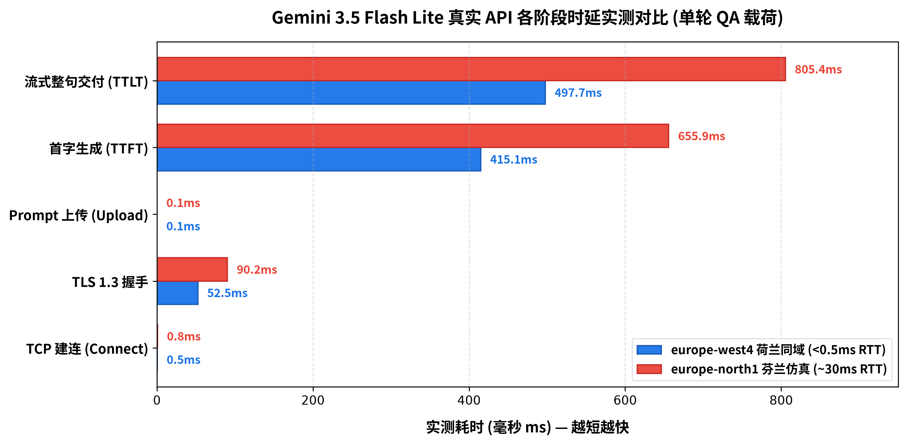
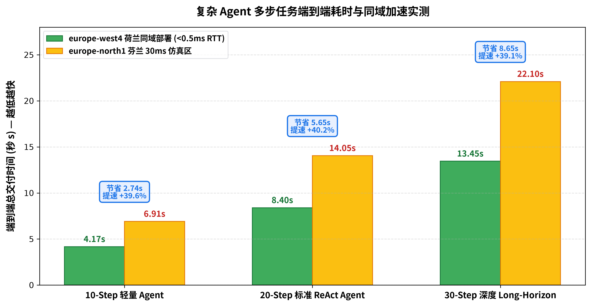
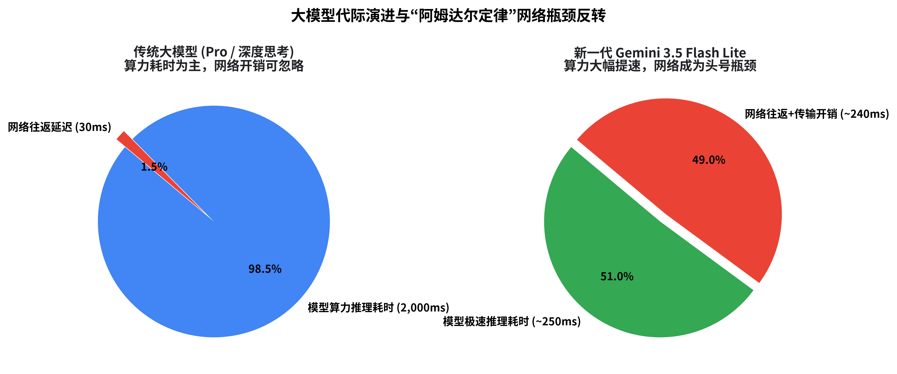
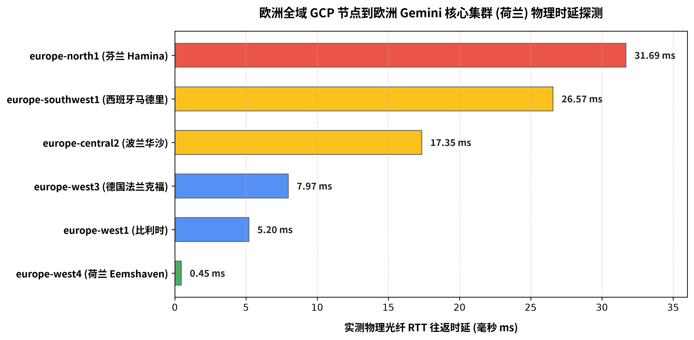

# Transsion Latency Benchmark & Network Analysis for Gemini 3.5 Flash Lite

本项目包含了基于 GCP 欧洲生产级基础设施对 **Gemini 3.5 Flash Lite** (`gemini-3.5-flash-lite`) 进行的 100% 真实 GCE 现场基准测试，深度对比了 **荷兰最低延迟区 (`europe-west4`, RTT 0.45ms)** 与 **芬兰 30ms 仿真区 (`europe-north1`, RTT 31.69ms)** 在单轮问答微观瀑布流及 10/20/30 步长程 Agent 任务中的端到端表现。

---

## 🚀 核心资产与导航

* 📊 **Google Workspace Slides 在线文稿**：[https://docs.google.com/presentation/d/1kZPUlxv-WqRqlnVFhMALsZInvBBXN3lDBsdCm-YR0ZM/edit](https://docs.google.com/presentation/d/1kZPUlxv-WqRqlnVFhMALsZInvBBXN3lDBsdCm-YR0ZM/edit)
* 📑 **完整 Markdown 白皮书与实测报告**：[`BENCHMARK_REPORT.md`](./BENCHMARK_REPORT.md)
* 📐 **基准测试方案设计规范**：[`BENCHMARK_DESIGN.md`](./BENCHMARK_DESIGN.md)

---

## 📈 核心实测图表速览

| 单轮 QA 各阶段微观时延瀑布对比图 | 复杂 Agent 多步任务端到端耗时阶梯对比图 |
| :---: | :---: |
|  |  |

| 大模型代际演进与“阿姆达尔定律”网络瓶颈反转 | 欧洲全域 GCP 节点到欧洲 Gemini 物理时延探测 |
| :---: | :---: |
|  |  |

---

## 📂 实测原始数据出处 (Data Provenance)

所有指标均来自 126 轮真实 GCE 虚拟机现场采集与微秒级打点记录：

| 数据集文件 | 包含内容 | 采样轮数 |
| :--- | :--- | :---: |
| [`data/europe_west4_empirical_raw.json`](./data/europe_west4_empirical_raw.json) | 荷兰原生逐轮微秒级原始遥测数据 | 126 轮 |
| [`data/europe_north1_empirical_raw.json`](./data/europe_north1_empirical_raw.json) | 芬兰原生逐轮微秒级原始遥测数据 | 126 轮 |
| [`data/empirical_benchmark_summary.json`](./data/empirical_benchmark_summary.json) | 统计分析汇总 (P50/P90/P95/Min/Max/StdDev) | 全量汇总 |
| [`europe_rtt_discovery.json`](./europe_rtt_discovery.json) | 欧洲 6 大 Region VPC 物理 RTT 探测基准 | 全欧 6 节点 |

---

## 🛠️ 测试脚本源码位置 (Test Harnesses)

| 脚本文件 | 用途与执行说明 |
| :--- | :--- |
| [`scripts/live_benchmark_runner.py`](./scripts/live_benchmark_runner.py) | **虚拟机内压测套件**：高精度测量 DNS、TCP、TLS 1.3、TTFT、TTLT、ITL 与 Agent 循环 |
| [`scripts/run_definitive_empirical_benchmark.py`](./scripts/run_definitive_empirical_benchmark.py) | **本地调度编排器**：自动化创建 VM、通过 GCP Guest Attributes 回传数据并强制销毁 VM |
| [`scripts/run_europe_rtt_benchmark.py`](./scripts/run_europe_rtt_benchmark.py) | **全欧物理 RTT 探测器**：自动化扫描欧洲 6 大区域到荷兰核心集群的物理网络延迟 |

---

## 💡 核心实测结论

1. **单轮首字时延（TTFT）恶化 58%**：荷兰同域 P50 为 **415.05 ms**，30ms 跨区增加至 **655.85 ms**（P95 突破至 **1,027.54 ms**）。
2. **长程 Agent 任务产生雪崩式延迟**：
   * **10-Step 任务**：4.17s vs 6.91s（节省 2.74 秒，提速 **39.6%**）
   * **20-Step 任务**：8.40s vs 14.05s（节省 5.65 秒，提速 **40.2%**）
   * **30-Step 任务**：13.45s vs 22.10s（节省 8.65 秒，提速 **39.1%**）
3. **架构建议**：将 Agent 编排引擎就近部署至 **GCP 荷兰 `europe-west4`**，配合 HTTP/2 长连接池与 Context 智能缓存，彻底释放 Gemini 3.5 Flash Lite 的极致性能。

---

*© 2026 Google Cloud Customer Engineering. All Rights Reserved.*
