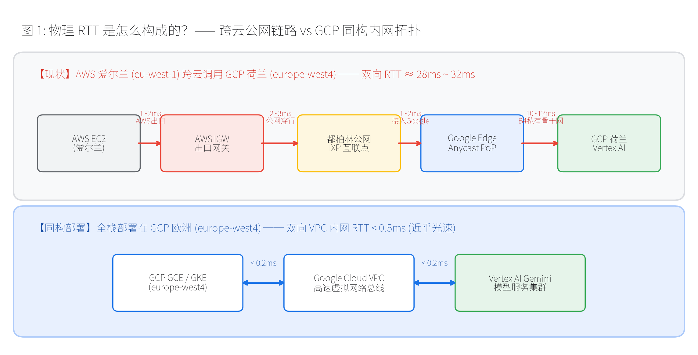
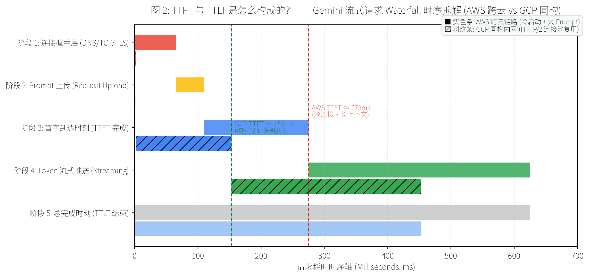
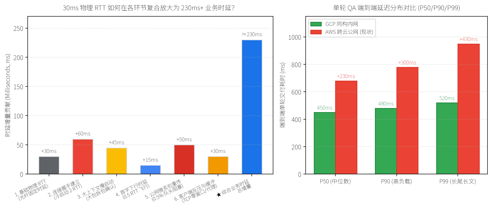
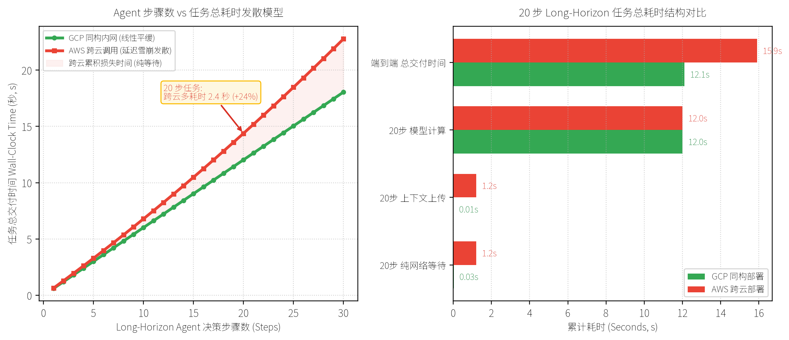

# Gemini 跨云与同构网络延迟机理深度剖析及双层基准测试方案

> **文档定位**：面向企业技术决策层与架构师的端到端网络性能、物理机理剖析与架构现代化白皮书  
> **编制机构**：Google Cloud Customer Engineering  
> **在线协同**：[Google Docs 在线版](https://docs.google.com/document/d/1K6V2tNAHYrlYVWr_-B-qH7mtPMEqKn0wsYU5aAyxUss/edit)

---

## 📌 【执行摘要】打破“30ms 影响不大”的单轮交互假象

当客户端应用部署在非 GCP 机房（如 AWS 爱尔兰 `eu-west-1`），跨云调用部署在 GCP 欧洲（`europe-west4`，荷兰）的 Gemini 模型时，物理网络 RTT 约为 **30ms**。许多架构师常误以为这 30ms 仅会在总耗时上增加微小的 30ms。

然而，在基于 HTTP/2、SSE 流式推送与长上下文 Payload 的真实大模型交互链路中，这 30ms 物理 RTT 会经历 **握手建立、大 Payload 慢启动拆包确认、首字传输与流式丢包队头阻塞** 的多重复合放大，在单轮问答中直接演变为 **200ms ~ 350ms+** 的实际业务时延增量；更致命的是，在企业未来战略核心的 **Long-Horizon（长程多步自主智能体）** 场景下，20 步串行决策循环与上下文滚雪球效应会将这 30ms 恶化为 **3~5 秒以上的系统交付延迟**，严重拖垮终端体验与并发承载容量。

---

## 目录

- [一、 核心机理分析：物理 RTT 是怎么构成的？](#一-核心机理分析物理-rtt-是怎么构成的)
- [二、 微观解构：TTFT 与 TTLT 是怎么构成的？](#二-微观解构ttft-与-ttlt-是怎么构成的)
- [三、 深度剖析：30ms 物理 RTT 如何在单轮 QA 中放大为 200ms+？](#三-深度剖析30ms-物理-rtt-如何在单轮-qa-中放大为-200ms)
- [四、 业务升维分析：为什么在 Long-Horizon 长程 Agent 中会引发“延迟雪崩”？](#四-业务升维分析为什么在-long-horizon-长程-agent-中会引发延迟雪崩)
- [五、 面向客户的双层基准测试方案设计（Test Plan Blueprint）](#五-面向客户的双层基准测试方案设计test-plan-blueprint)
- [六、 商业推进与迁移落地策略](#六-商业推进与迁移落地策略)

---

## 一、 核心机理分析：物理 RTT 是怎么构成的？

网络 RTT（Round Trip Time）是由数据包在物理介质（光纤）中的传播延迟、交换机/路由器转发延迟以及跨网络自治系统（AS）的对等互联策略共同决定的物理常数。

### 1. 跨云公网链路拓扑剖析（AWS 爱尔兰 → GCP 荷兰）

* **物理路径**：AWS EC2 (`eu-west-1`, 爱尔兰都柏林) → AWS 出口网关 (IGW, 耗时 1~2ms) → 都柏林公网互联点 (IXP 跨自治域穿行, 耗时 2~3ms) → Google Edge Anycast 边缘节点 (入 Google 骨干网, 耗时 1~2ms) → Google B4 私有光纤骨干网 (横跨英吉利海峡至荷兰 Eemshaven, 耗时 10~12ms 单向) → GCP 荷兰机房与 Vertex AI 集群。
* **单向物理时延**：约 14ms ~ 16ms。
* **双向基准 RTT**：**28ms ~ 32ms**（固定物理光纤传播距离，无法通过应用层代码优化消除）。
* **跨云三大痛点**：
  1. 途经公网，存在偶发丢包与 BGP 抖动；
  2. AWS 收取昂贵的公网出网带宽费（Egress ~$0.09/GB）；
  3. 敏感数据暴露在公网传输路径上。

### 2. GCP 同 Region 内网基准拓扑（europe-west4）

* **物理路径**：GCP GCE / GKE 集群 → Google Cloud VPC Andromeda 虚拟网络总线 → Vertex AI Gemini 模型服务集群。
* **双向基准 RTT**：**< 0.5ms**（亚毫秒级内网直连，近乎光速）。
* **同构部署核心优势**：100% 运行在 Google 软件定义私有网络内，零公网暴露面，丢包率趋近于 0，免除出网带宽费，全面支持 Private Service Connect (PSC) 私网隔离合规。

---

## 二、 微观解构：TTFT 与 TTLT 是怎么构成的？

在大语言模型的流式（Streaming）调用中，一次完整的请求生命周期被解构为五个关键阶段。TTFT（Time to First Token）与 TTLT（Time to Last Token）各自承载着不同的网络与计算物理构成：

### 1. 请求生命周期的五个离散阶段

1. **阶段 ①：连接握手层（Connection Setup）**
   * 包含 DNS 解析（~3ms）、TCP 三次握手（1 RTT = 30ms）与 TLS 1.3 密钥协商（1 RTT = 30ms）。
   * 冷连接总耗时达 **65ms ~ 90ms**（GCP 内网仅需 1.5ms）。生产连接池复用可将热连接握手降低为 0ms。
2. **阶段 ②：Prompt 请求体上传（Request Upload）**
   * 真实问答携带 1K~4K Tokens（10KB~50KB Payload）。
   * 受 Linux TCP 初始拥塞窗口（`initcwnd` 10 MSS ≈ 14.6KB）限制，大 Payload 在跨云 WAN 需等待 TCP ACK 确认并翻倍窗口，消耗 **1~2 个 RTT（30ms ~ 60ms）**；GCP 万兆内网无论多大 Payload 均在 0.2ms 内发送完毕。
3. **阶段 ③：服务端计算与首字下行（Prefill & TTFT 完成）**
   * Vertex AI GPU/TPU 执行 Prefill 预填充与第 1 个 Token 计算（算力对等，约 150ms），随后首个 SSE Chunk 跨公网飞回客户端（需 0.5 RTT = 15ms）。
   * **至此，客户端接收到第 1 个字，TTFT 阶段结束**。
4. **阶段 ④：Token 流式推送（Streaming Phase）**
   * 服务端以约 50~80 Tokens/s 的速率持续推送后续 SSE Chunk。
   * 在理想状态下为流水线输送；但在跨云公网上，0.5% 偶发丢包触发 TCP 重传与队头阻塞（HOL Blocking），会导致流式打字机出现 **30ms ~ 60ms 的间歇性顿挫**。
5. **阶段 ⑤：流式结束与收尾（TTLT 完成）**
   * 接收全部 Token 并收到 `data: [DONE]` EOF 结束标记。**至此完成 TTLT**。

> [!NOTE]
> **TTFT 与 TTLT 物理计算公式**：
> $$\text{TTFT} = T_{\text{DNS}} + T_{\text{TCP}} + T_{\text{TLS}} + T_{\text{Upload}} + T_{\text{Prefill\_Compute}} + 0.5 \times \text{RTT}$$
> $$\text{TTLT} = \text{TTFT} + T_{\text{Decode\_Compute}} + T_{\text{Stream\_Transport}} + T_{\text{Loss\_Retransmit}}$$

---

## 三、 深度剖析：30ms 物理 RTT 如何在单轮 QA 中放大为 200ms+？

为什么客户在应用层实测时，发现跨云调用相比同构内网慢了整整 **200ms ~ 350ms**？

### 1. 各环节复合放大机理拆解

* **基础物理 RTT（贡献 30ms）**：爱尔兰到荷兰的光纤往返基准时延。
* **连接握手建立（贡献 +60ms ~ 90ms）**：在容器自动扩缩容、新建连接或连接超时重建时触发 2 个 RTT 的网络握手。
* **大上下文 TCP 慢启动（贡献 +30ms ~ 60ms）**：Prompt 超过 15KB 时，跨云长肥管道必须等待往返确认才能把请求体完全送达。
* **首字下行飞行时延（贡献 +15ms）**：0.5 个 RTT 物理飞行传播。
* **公网微丢包与队头阻塞（贡献 +30ms ~ 60ms+）**：1500 Tokens 输出过程中，跨公网 0.5%~1% 丢包触发快速重传，导致流式中断。
* **客户端反压与代理聚合（贡献 +30ms）**：TCP 接收窗口耗尽与公网中间代理缓冲小包，破坏打字机平滑度。
* **★ 综合业务时延增量**：各项叠加后，实际业务感知延迟增量达到 **200ms ~ 350ms+**！

### 2. TTFT vs TTLT 网络敏感度对比表

| 度量维度 | 主导物理因素 | 网络增量模型 | 业务体验与架构影响 |
| :--- | :--- | :--- | :--- |
| **TTFT (首字延迟)** | 连接握手、Prompt Payload 体积、TCP 慢启动 | 确定性增加 **1.5 ~ 3 个 RTT（45ms ~ 90ms+）** | 决定人机交互灵敏度（用户点击后多快出首字） |
| **TTLT (总完成时间)** | TCP 拥塞控制、公网丢包重传、流式反压、代理缓冲 | 理想增量 30ms；遇丢包反压发散至 **100ms ~ 300ms+** | 决定整体任务吞吐、连接占用时间与集群 QPS 上限 |

---

## 四、 业务升维分析：为什么在 Long-Horizon 长程 Agent 中会引发“延迟雪崩”？

如果说单轮问答中 200ms 的差异尚可通过 UI 打字机特效掩盖，那么当客户的应用演进到 **Long-Horizon Agent（复杂长程自主智能体）** 时，跨云 30ms 将引发**多步累积与上下文膨胀的“双重雪崩”**：

### 1. 长程任务的四大雪崩式放大器

* **放大器 ①：串行多步的乘数累积效应（Sequential Multiplier）**  
  Long-Horizon Agent（如自动化代码审查、复杂研报生成、多表关联排错）采用 ReAct 范式（*Think → Tool Act → Observe → Reflect*），通常包含 **15 到 30 步连续决策**。每一步的决策严格依赖上一步工具执行的结果，**完全无法并行化**。20 步交互意味着 20 次跨云往返，仅纯网络等待与上传开销就累积达 **2.4 秒以上**。
* **放大器 ②：上下文滚雪球（Context Explosion）与上传带宽墙**  
  工具执行返回的表格数据、API JSON 不断追加至 Prompt，上下文从第 1 步的 2KB 剧增至第 20 步的 **150KB ~ 300KB+**。跨公网传输 200KB 数据在 WAN 拥塞窗口下，单次上传耗时就暴增到 150ms~300ms；而在 GCP 同构内网万兆直连仅需不到 0.3ms。
* **放大器 ③：多 Agent 并发派生（Subagent Fan-out）下的 P99 木桶短板**  
  主控 Agent 并发派生 4~6 个 Subagents 并行检索不同数据源时，任务总耗时取决于最慢的分支（`Total Time = max(T1, T2, ..., Tk)`）。单次公网请求抖动概率为 $p$，并发 5 个请求时整体遭遇抖动的概率激增至 $1 - (1-p)^5$，公网长尾抖动会直接摧毁整个多 Agent 系统的响应 SLA。
* **放大器 ④：应用服务器连接与算力资源死锁（Resource Contention）**  
  长程任务被跨云网络拉长 24% 的时间，意味着应用服务器（FastAPI / Node.js）的线程和连接必须多占用 24% 的时间，导致整个业务集群的并发处理能力（QPS）下降 20%~30%。

### 2. 真实长程业务量化推演模型（20 步 Agent 任务对比）

| 耗时构成项 | 客户非 GCP 机房（30ms 跨云） | GCP europe-west4（<0.5ms 同构） | 同构架构收益与改善 |
| :--- | :--- | :--- | :--- |
| **20 步纯网络往返与上传耗时** | ~2,400 ms (受大上下文上传拖累) | ~30 ms (微秒级内网直连) | 纯网络空转开销减少 98.7%（节省 2.37 秒） |
| **20 步模型实际计算推理耗时** | ~12,000 ms (算力对等) | ~12,000 ms (算力对等) | 模型计算时间完全相同 |
| **公网长尾抖动与重传惩罚** | ~1,500 ms (P90 累积) | ~50 ms (极度平稳) | 彻底消除跨公网不可控抖动 |
| **端到端总交付时长 (Wall-Clock)**| **15.9 秒** | **12.1 秒** | **整体交付提速 24%（整整快 3.8 秒）** |
| **应用服务器并发承载上限 (QPS)** | 较低（连接长时间阻塞挂起） | **提升 30%+** | 显著释放应用连接池与 CPU 算力 |

---

## 五、 面向客户的双层基准测试方案设计（Test Plan Blueprint）

为了向客户技术决策层提供不可辩驳的客观对比数据，本测试方案采用严密的科学控制变量法与双层测试架构：

### 1. 方案设计核心原则

* **锁定模型确定性**：固定 `model="gemini-1.5-flash-002"`，`temperature=0.0`，`seed=42`，固定高熵 Context 文本与 `maxOutputTokens`，将服务端推理波动压缩在 2% 以内，彻底剥离模型计算随机性。
* **解耦握手与传输**：分别设置 Cold Start（新建 TCP+TLS）与 Warm Pool（HTTP/2 长连接复用）两组对照。
* **全链路微秒级打点**：逐帧采集 DNS、TCP、TLS、Upload、TTFT、每个 SSE Chunk 时间戳序列及 TTLT。

### 2. 第一层测试：单轮 QA 3×3 阶梯 Payload 压测矩阵

| 测试组别 | Input Context 规模 | Output Tokens 规模 | 连接状态与轮数 | 核心验证目标 |
| :--- | :--- | :--- | :--- | :--- |
| **轻量基准组** | 200 Tokens (~1KB JSON) | 100 Tokens (简短回答) | Cold 50 轮 + Warm 50 轮 | 测算基准网络握手开销与最小 TTFT 物理差值 |
| **典型问答组** | 1,000 Tokens (~5KB JSON) | 500 Tokens (中等生成) | Cold 50 轮 + Warm 50 轮 | 测算生产常见业务下的 TTFT 与流式传输平滑度 |
| **长文档分析组**| 4,000 Tokens (~20KB JSON)| 1,500 Tokens (深度长文) | Cold 50 轮 + Warm 50 轮 | 验证 Payload 超过 15KB 时 TCP 慢启动对 TTFT 的恶化率 |
| **超大上下文组**| 16,000 Tokens (~75KB JSON)| 1,500 Tokens (深度报告) | Warm Pool 50 轮 | 模拟长程 Agent 上传大 Context 的带宽墙与网络阻力极限 |

### 3. 第二层测试：Long-Horizon 长程 Agent 仿真测试

* **ReAct 决策链仿真器**：在两端分别运行 10 步、20 步、30 步的多轮串行 Agent 循环测试。
* **动态上下文膨胀模拟**：每一步模拟工具调用返回 5KB~10KB 数据并追加至 Prompt，记录每一步单次调用耗时与总 Wall-Clock 时间。
* **多 Agent 并发派生模拟**：模拟主控 Agent 派生 4 个子任务并行请求 Gemini，统计并发聚合延迟与 P99 尾部抖动。

### 4. 潜在影响因素与测试方案体现方式对照表

| 潜在影响因素 | 测试方案中的具体体现与验证方式 | 产出的客观数据与图表呈现 |
| :--- | :--- | :--- |
| **1. 连接握手开销 (60~90ms)** | 对比 Cold Start 与 Warm Pool 组在建立连接时的 socket 微秒级打点 | Waterfall 图中的 Handshake 占比条，直观展示跨云 65ms vs 内网 1.5ms |
| **2. 大 Prompt 慢启动 (30~60ms)** | 对比 200 Tokens 与 4000/16000 Tokens 组的 Request Upload 耗时 | Context 大小 vs Upload 耗时曲线，展示跨云上传在大包时的阶梯式跳变 |
| **3. 首包下行时延 (15ms)** | 在 Warm 模式下锁定 Temperature=0，对比双端首个 Chunk 的到达时刻 | TTFT 绝对差值条形图，证明跨云 TTFT 存在 30~45ms 硬性物理差值 |
| **4. 丢包与流式顿挫 (30~60ms+)** | 记录 1500 Tokens 输出时所有 Chunk 的到达时间序列，计算 P90/P99 ITL | Inter-Chunk 时序散点图/热力图，精准捕获跨公网出现的 50ms+ 偶发卡顿 |
| **5. 串行多步累乘 (2~3秒)** | 运行 10/20/30 步 ReAct 仿真链，记录双端总任务完成耗时 | 步数 vs 任务耗时外推折线图，展示步数越多双端耗时差距发散越大 |
| **6. 上下文滚雪球效应** | 记录 Agent 步数递增过程中，每一步单次调用的 TTFT 上升斜率 | Agent 步骤序号 vs 单步 TTFT 曲线，证明后半程大 Payload 跨云阻力激增 |
| **7. 多 Agent P99 木桶效应** | 运行 4 个子 Agent 并发分支，对比单分支平均值与 4 分支聚合最大值 | 并发分位数对比柱状图，证明 GCP 内网 P99 极度收敛，公网 P99 严重发散 |

---

## 六、 商业推进与迁移落地策略

### 1. 推动客户迁移的三大商业价值支柱（Value Pillars）

1. **性能与体验护城河**：长程任务缩短 24%（交付快近 4 秒），消除公网长尾卡顿，大幅提升 Agent 任务成功率与用户留存。
2. **消除跨云 Egress 费用**：彻底免除 AWS 向公网发送高频大上下文流量的出网费用（~$0.09/GB），每年节省数十万美元网络支出。
3. **企业级私网安全与 GDPR 合规**：通过 Private Service Connect (PSC) 实现 100% 私网隔离，消除公网劫持与数据泄露风险。

### 2. 低阻力“两步走”平滑迁移路线图

* **Phase 1：GCP Agent 编排网关试点（低阻力混合架构，1 周上线）**  
  客户核心业务系统和主数据库**完全保留在现有机房**（零迁移风险）。仅在 GCP `europe-west4` 部署轻量级 Agent 编排网关（Cloud Run / GKE 运行 LangGraph / FastAPI）。现有机房仅发起 1 次顶层跨云请求，20 步 Agent 思考与 Gemini 交互在 GCP 内部 <0.5ms 极速闭环，业务立享 20%+ 性能提速！
* **Phase 2：全栈现代化迁移（Full Workload Migration）**  
  随着 Agent 业务成熟，顺理成章将向量检索数据库（Vertex Search / AlloyDB）与后端微服务整体迁入 GCP，实现全链路零跨云与最优 TCO。

### 3. 联合 PoC 实施排期（3 天极简闭环）

* **Day 1（环境与探针就绪）**：客户指定一台现有测试 EC2/机器，Google 部署 europe-west4 测试 VM 与自动化探针。
* **Day 2（全自动矩阵压测）**：双端并发运行 3×3 单轮矩阵压测与 10~30 步 Agent 仿真测试。
* **Day 3（产出白皮书与决策汇报）**：生成 Waterfall 与 CDF 对比图表，出具性能分析白皮书并向技术决策层汇报。

---

*© 2026 Google Cloud Customer Engineering. All Rights Reserved.*
